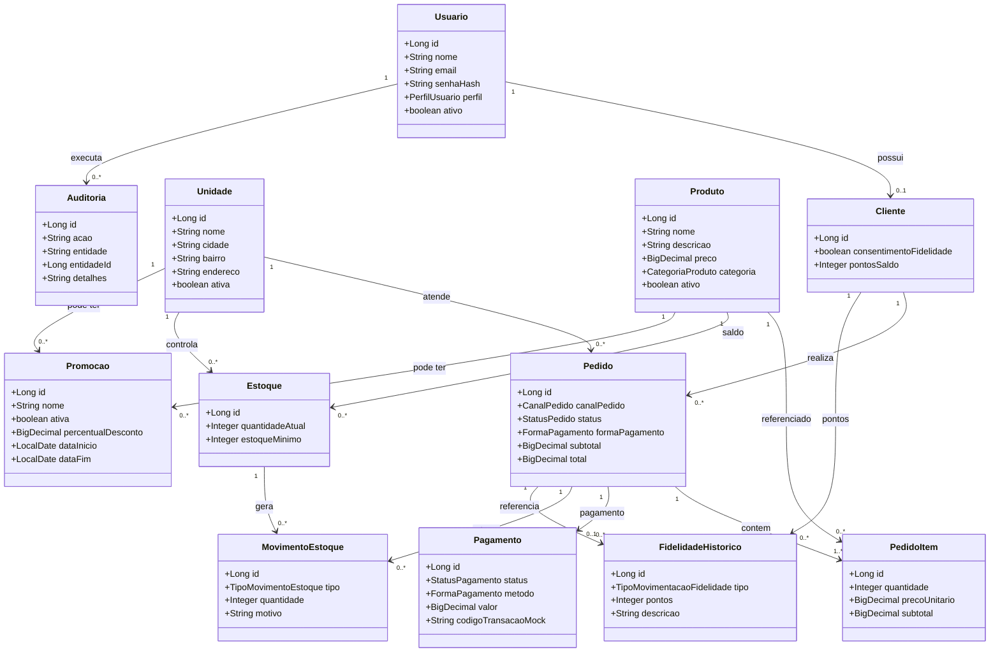

# Diagrama de Classes (Dominio)

```mermaid
classDiagram
    class Usuario {
      +Long id
      +String nome
      +String email
      +String senhaHash
      +PerfilUsuario perfil
      +boolean ativo
    }

    class Cliente {
      +Long id
      +boolean consentimentoFidelidade
      +Integer pontosSaldo
    }

    class Unidade {
      +Long id
      +String nome
      +String cidade
      +String bairro
      +String endereco
      +boolean ativa
    }

    class Produto {
      +Long id
      +String nome
      +String descricao
      +BigDecimal preco
      +CategoriaProduto categoria
      +boolean ativo
    }

    class Pedido {
      +Long id
      +CanalPedido canalPedido
      +StatusPedido status
      +FormaPagamento formaPagamento
      +BigDecimal subtotal
      +BigDecimal total
    }

    class PedidoItem {
      +Long id
      +Integer quantidade
      +BigDecimal precoUnitario
      +BigDecimal subtotal
    }

    class Pagamento {
      +Long id
      +StatusPagamento status
      +FormaPagamento metodo
      +BigDecimal valor
      +String codigoTransacaoMock
    }

    class Estoque {
      +Long id
      +Integer quantidadeAtual
      +Integer estoqueMinimo
    }

    class MovimentoEstoque {
      +Long id
      +TipoMovimentoEstoque tipo
      +Integer quantidade
      +String motivo
    }

    class Promocao {
      +Long id
      +String nome
      +boolean ativa
      +BigDecimal percentualDesconto
      +LocalDate dataInicio
      +LocalDate dataFim
    }

    class FidelidadeHistorico {
      +Long id
      +TipoMovimentacaoFidelidade tipo
      +Integer pontos
      +String descricao
    }

    class Auditoria {
      +Long id
      +String acao
      +String entidade
      +Long entidadeId
      +String detalhes
    }

    Usuario "1" --> "0..1" Cliente : possui
    Cliente "1" --> "0..*" Pedido : realiza
    Unidade "1" --> "0..*" Pedido : atende
    Pedido "1" --> "1..*" PedidoItem : contem
    Produto "1" --> "0..*" PedidoItem : referenciado
    Pedido "1" --> "0..1" Pagamento : pagamento
    Unidade "1" --> "0..*" Estoque : controla
    Produto "1" --> "0..*" Estoque : saldo
    Estoque "1" --> "0..*" MovimentoEstoque : gera
    Pedido "1" --> "0..*" MovimentoEstoque : origem
    Cliente "1" --> "0..*" FidelidadeHistorico : pontos
    Pedido "1" --> "0..*" FidelidadeHistorico : referencia
    Produto "1" --> "0..*" Promocao : pode ter
    Unidade "1" --> "0..*" Promocao : pode ter
    Usuario "1" --> "0..*" Auditoria : executa
```
