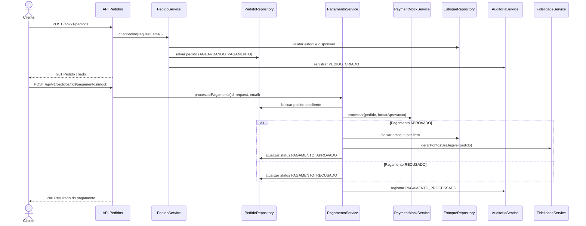

# Diagrama de Sequencia - Pedido e Pagamento Mock

```mermaid
sequenceDiagram
    actor Cliente
    participant API as API Pedidos
    participant PS as PedidoService
    participant PR as PedidoRepository
    participant PM as PagamentoService
    participant MK as PaymentMockService
    participant ER as EstoqueRepository
    participant AR as AuditoriaService
    participant FS as FidelidadeService

    Cliente->>API: POST /api/v1/pedidos
    API->>PS: criarPedido(request, email)
    PS->>ER: validar estoque disponivel
    PS->>PR: salvar pedido (AGUARDANDO_PAGAMENTO)
    PS->>AR: registrar PEDIDO_CRIADO
    API-->>Cliente: 201 Pedido criado

    Cliente->>API: POST /api/v1/pedidos/{id}/pagamentos/mock
    API->>PM: processarPagamento(id, request, email)
    PM->>PR: buscar pedido do cliente
    PM->>MK: processar(pedido, forcarAprovacao)

    alt Pagamento APROVADO
        PM->>ER: baixar estoque por item
        PM->>FS: gerarPontosSeElegivel(pedido)
        PM->>PR: atualizar status PAGAMENTO_APROVADO
    else Pagamento RECUSADO
        PM->>PR: atualizar status PAGAMENTO_RECUSADO
    end

    PM->>AR: registrar PAGAMENTO_PROCESSADO
    API-->>Cliente: 200 Resultado do pagamento
```
